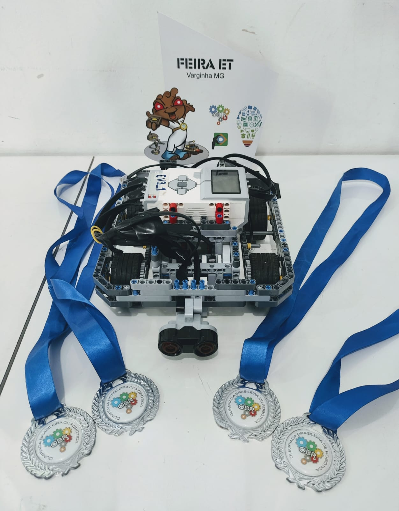

# 🤖 Temporada 2026


## 🛠️ Tecnologias Utilizadas

| Tecnologia | Finalidade |
| :--------- | :--------- |
| 🤖 LEGO MINDSTORMS EV3 | Controle da locomoção e sensores |
| 🍓 Raspberry Pi 5 | Processamento auxiliar e visão computacional |
| 🐍 MicroPython | Desenvolvimento das aplicações da Raspberry Pi |

---

## 🏅 Resultados

| Etapa | Resultado |
| :---- | :-------: |
| 🥈 Regional | **2º Lugar** |
| 🏆 Estadual | _Aguardando competição..._ |
| 🌎 Nacional | _Aguardando classificação..._ |

 <!--<p align="center">
 
 
  
</p> -->

---

## 📂 Estrutura

```text
2026/
├── Lego/
├── Raspberry/
└── README.md
```

Cada diretório contém o código-fonte e os arquivos relacionados à respectiva plataforma.

---

# 🍓 Raspberry PI 


## 🔧 Componentes

### ⚡ Eletrônica

| Item | Valor |
|------|-------|
| Raspberry Pi 5 |  |
| 2x Picamera |  |
| Ponte H l298n |  |
| 2x Motores 130 |   |
| Fita led |  |
| Micro Servo SG90 |  |
| 2x Bateria |  |


### 💻 Software

## Bibliotecas utilizadas

<div align="left">
  
  
  
  
</div>

<br>

## 🚀 Objetivo

O projeto foi desenvolvido para integrar o **LEGO EV3** e a **Raspberry Pi 5**, explorando o potencial de cada plataforma para obter um robô mais robusto, preciso e eficiente nas provas da OBR.
