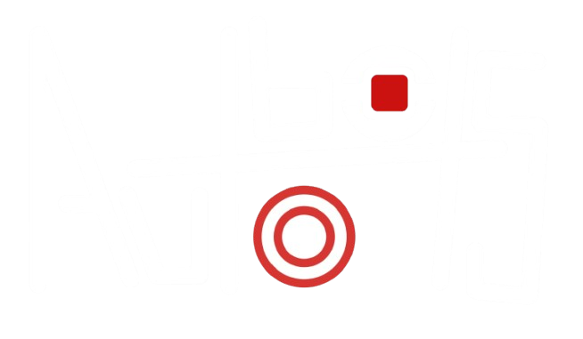
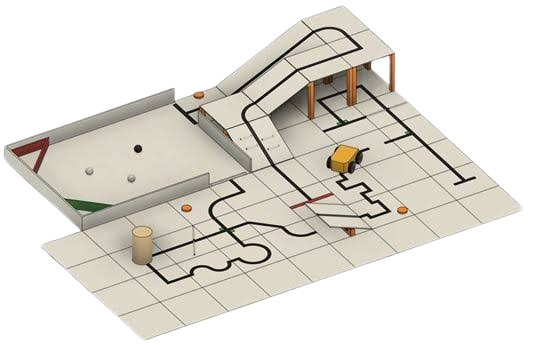

  

## 🚀 Sobre a Equipe
A **AutoBots**, vinculada ao Instituto Federal do Sul de Minas – Campus Machado, é formada por seis integrantes e atua no desenvolvimento de **sistemas robóticos autônomos** para a Olimpíada Brasileira de Robótica (OBR).

Nosso foco é projetar, programar e otimizar robôs capazes de executar tarefas complexas de forma independente, unindo **hardware + software + estratégia**.

---

## 👥 Integrantes

**👨‍💻 Alunos**  
- Davi Vinagre  
- Iago Nunes  
- Gustavo Porto  
- Marcos Sepini  

**🎓 Professor Coach**  
- Matheus Monteiro  
  _Orientação estratégica e suporte técnico-acadêmico_

**📚 Professor Responsável**  
- Matheus Franco  

## 📱 Redes

## 🏆 A Competição — Olimpíada Brasileira de Robótica (OBR)

  

A **Olimpíada Brasileira de Robótica (OBR)** é uma das maiores competições de robótica educacional do Brasil. Na modalidade prática, as equipes desenvolvem robôs **totalmente autônomos**, capazes de navegar por ambientes que simulam situações reais de resgate, exigindo programação, eletrônica e engenharia mecânica.

### Objetivos da prova

| Desafio | Descrição |
| :------ | :-------- |
| 🚗 Navegação Autônoma | Seguir linhas e percorrer o percurso sem intervenção humana. |
| 🧱 Obstáculos | Identificar e superar rampas, desníveis e barreiras. |
| 🎯 Precisão | Tomar decisões e executar ações com alta confiabilidade. |
| 🛟 Resgate | Localizar e transportar vítimas até a área segura. |

> 💡 Cada temporada apresenta novos desafios, incentivando inovação, trabalho em equipe e aprimoramento contínuo.

 

## 🎯 Objetivo

Desenvolver soluções cada vez mais eficientes e inteligentes, evoluindo continuamente para alcançar alto desempenho nas competições da OBR.

---

💡 _"Transformando código em movimento."_  
